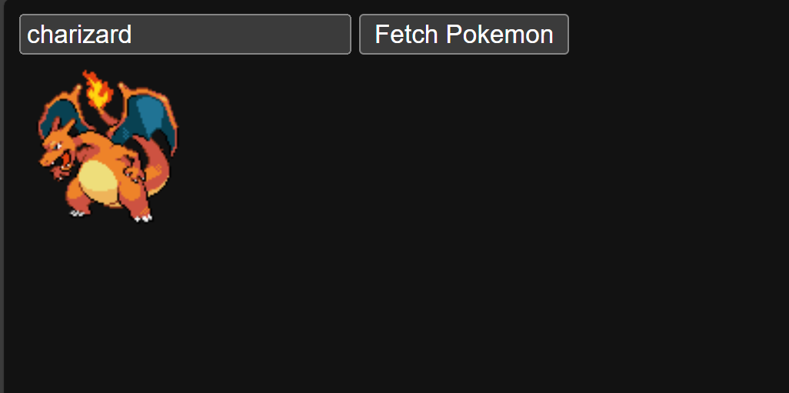
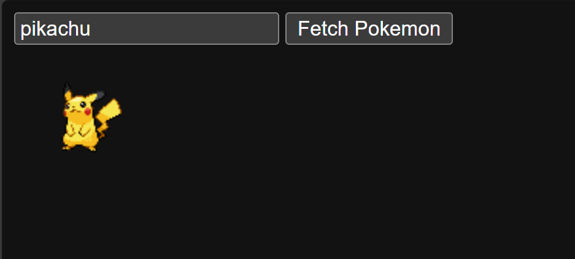
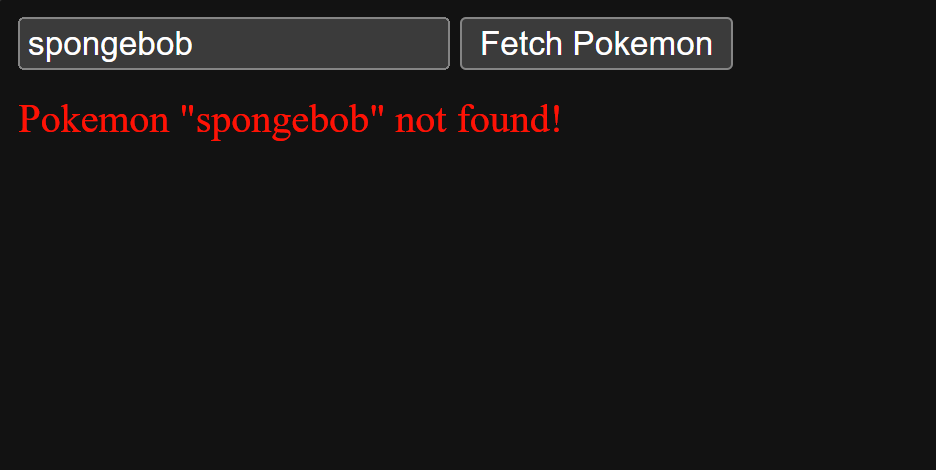

# Fetch Pokemon

A simple web application that demonstrates API integration using the [PokeAPI](https://pokeapi.co/). This project allows users to search for Pokemon by name and view their images.

## Features
- Search Pokemon by name
- Display Pokemon sprite images
- Error handling for failed API requests
- Simple and clean user interface

## How it looks like

## Technologies Used
- HTML
- JavaScript
- [PokeAPI](https://pokeapi.co/) - A RESTful Pokemon API

## Learning Outcomes
This project demonstrates:
- How to make API calls using JavaScript's `fetch` API
- Handling asynchronous operations using async/await
- Basic DOM manipulation
- Error handling
- Working with JSON responses
